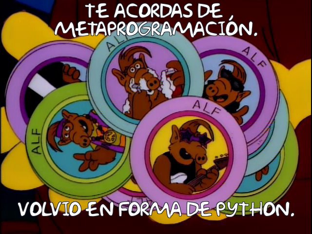
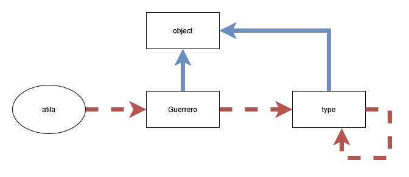

# Metaprogramación en Python



<!-- 
Introducir python objetos simples, funciones, y clases
-->

---

## ¿Qué es un objeto?

```python
class Guerrero:
    def __init__(self, vida, ataque):
        self.vida = vida
        self.ataque = ataque

    def atacar(self, objetivo):
        ...

    def recibir_daño(self, cantidad):
        ...

atila = Guerrero(100, 100)
```
<!--
Hablar de los objectos como diccionarios y metodos como funciones vinculadas.
Mostrar metamodelo.
Uso de clases como funciones (Aclarar bien que type viene con un __call__)
Uso de __dict__ vs getmembers
-->

---

## Lookup



<!--
Introducir herencia multiple y escribir en el pizaron o editor segun disponibilidad.
-->
---

## Magias que no son magias

<!-- 

-->

---

## Decorators

```python
class Guerrero:
    @validar(int, int)
    def __init__(self, vida, ataque):
        self.vida = vida
        self.ataque = ataque
```

<!--
Introducir decorators. 
Función vs Clase
Wraps
-->

---

## Descriptors

```python
class Guerrero:
    def __init__(self, vida, ataque):
        self._vida = vida
        self.ataque = ataque

    @property
    def vida(self):
        return self._vida
    
    @vida.getter
    def vida(self, nuevo_valor):
        if nuevo_valor < 0:
            raise ValueError()
        self._vida = nuevo_valor
```

<!-- 
Volver al diagrama y mostrar que es necesario un lugar nuevo para intervenir el envio de mensaje.
Mostrar implementación.
-->

---

## Utilidades de los descriptores

<!--
Mostrar classmethod, staticmethod y CachedProperty
-->

---

## Metodos estaticos

```python
class Guerrero:
    @staticmethod
    def ejercito():
        return [Guerrero(100, 100) for _ in Range(100)]

Guerrero.ejercito() # => Devuelve lista con cien guerreros
Guerrero().ejercito() # => Devuelve lista con cien guerreros
```

---

## Metodos de clases

```python
class Guerrero:
    @classmethod
    def ejercito(cls):
        return [cls(100, 100) for _ in Range(100)]

Guerrero.ejercito() # => Devuelve lista con cien guerreros
Guerrero().ejercito() # => Devuelve lista con cien guerreros
```

---

## Atributos lazy

```python
class Guerrero:
    @cachedproperty
    def nivel(self):
        # Calculo recursivo complejo
        ...
```

---

## Metaclases

```python
class Defensor(metaclass=ABCMeta):
    @abstractmethod
    def descansar(self): ...
```

<!--
Mostrar lookup_defensor.jpg si hace falta
-->

---

## Super

```python
class Unidad:
    def descansar(self): ...

class Defensor(Unidad):
    vida: int
    
    def descansar(self):
        self.vida = 100
        super().descansar()


class Atacante(Unidad):
    descansado: bool

    def descansar(self):
        self.descansado = True
        super().descansar()

class Guerrero(Atacante, Defensor):
    ...
```

<!--
Aclarar la trampa de python con el relleno de los parametros
-->